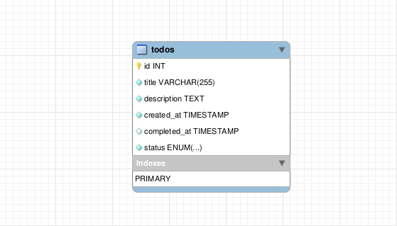

# Lista de tarefas: Desafio Softpar

Este é um **projeto completo de lista de tarefas** desenvolvido como parte do processo seletivo para a vaga de desenvolvedor full stack na Softpar. A aplicação permite criar, visualizar, atualizar, excluir e gerenciar tarefas com três status: **Pendente**, **Em andamento** e **Concluído**.

---

## Funcionalidades

- **Criar Tarefas**: Adicionar novas tarefas com título, descrição e status padrão (`Pendente`).
- **Visualizar Tarefas**: Listar todas as tarefas com opções de filtros e ordenação.
- **Atualizar Tarefas**: Editar tarefas, incluindo status e outros campos.
- **Excluir Tarefas**: Remover tarefas da lista.
- **Filtros**: Filtrar tarefas por status ou por data de criação.
- **Ordenação**: Ordenar tarefas por título ou data.

---

## Tecnologias Utilizadas

### Front-end:
- **Vue.js** (com Quasar Framework): Interface responsiva e escalável.
- **TypeScript**: Garantia de segurança de tipos e melhor experiência de desenvolvimento.
- **Pinia**: Gerenciamento de estado.

### Back-end:
- **Laravel**: Framework para criação de APIs RESTful e lógica de negócios.
- **PostgreSQL**: Banco de dados relacional para armazenamento persistente.

---

## Documentação da API

### Endpoints

1. **GET** `/api/todos`  
   - Lista todas as tarefas.
  
2. **POST** `/api/todos`  
   - Cria uma nova tarefa.  
   **Corpo da Requisição**:  
   ```json
   {
     "title": "string",
     "description": "string",
     "status": "pending" | "in progress" | "completed"
   }
   ```

3. **GET** `/api/todos/{id}`  
   - Obtém uma tarefa específica pelo ID.

4. **PUT** `/api/todos/{id}`  
   - Atualiza uma tarefa.  
   **Corpo da Requisição**:  
   ```json
   {
     "title": "string",
     "description": "string",
     "status": "pending" | "in progress" | "completed"
   }
   ```

5. **DELETE** `/api/todos/{id}`  
   - Exclui uma tarefa pelo ID.

---

## Instalação e Configuração

### Pré-requisitos
- **Node.js** (v16 ou superior)
- **PHP** (v8.1 ou superior)
- **Laravel** (v10 ou superior)
- **Composer**
- **PostgreSQL** (v12 ou superior)

### Configuração inicial

```bash
git clone https://github.com/luizhf42/todo-app-softpar.git # clone o repositório

cd todo-app-softpar # acesse a pasta
```

### Configuração do Backend

```bash
cd backend # acesse a pasta de backend

composer install # instale as dependências

cp .env.example .env # copie o arquivo de exemplo para o arquivo de configuração

# edite o arquivo .env e configure as variáveis do banco de dados
# DB_CONNECTION=pgsql
# DB_HOST=127.0.0.1
# DB_PORT=5432
# DB_DATABASE=todo_app
# DB_USERNAME=seu_usuario # substitua "seu_usuario" pelo seu usuário do PostgreSQL
# DB_PASSWORD=sua_senha   # substitua "sua_senha" pela senha do seu usuário

# crie o banco de dados manualmente no PostgreSQL
psql -U seu_usuario -c "CREATE DATABASE todo_app;"

php artisan migrate # execute as migrações do banco de dados

php artisan serve # inicie o servidor de desenvolvimento
```

O servidor irá será aberto em `http://localhost:8000`.

### Configuração do Frontend

```bash
cd frontend # acesse a pasta de frontend

npm install # instale as dependências

npm run dev # execute o servidor de desenvolvimento
```
O servidor será aberto em `http://localhost:9000`.

---

## Uso

1. Abra o front-end em `http://localhost:9000`.

2. Use a aplicação: crie, atualize, exclua e filtre tarefas.

3. Também teste a API, disponível em `http://localhost:8000/api`.

---

## Estrutura do banco de dados

Decidi manter apenas uma tabela pois não vi necessidade de adicionar outras ou de ter relacionamentos nesse caso. As colunas refletem o que foi pedido no desafio.

---
## Autor

**Luiz Henrique**  
[GitHub](https://github.com/luizhf42) | [LinkedIn](https://www.linkedin.com/in/luizhf42)